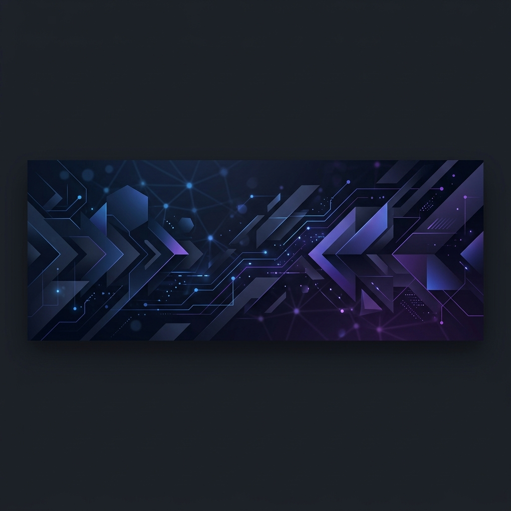

<!-- Animated Banner -->

 

<!-- Profile Views -->

  

<!-- Greeting -->
<h1>Hi, I'm Moin Sarwar 👋</h1>

<!-- Typing Animation -->

  

<!-- CTA Buttons -->

&nbsp;

&nbsp;

  

<!-- Quick Stats -->
| 🏆 8+ Years Experience | 🏢 6+ Companies | 🔗 50+ Integrations Built | 🤖 AI-Powered Projects |
|:---:|:---:|:---:|:---:|

---

## 👨‍💻 About Me

<table>
<tr>
<td width="50%" valign="top">

**🏢 Current Role**
Senior Software Developer working on enterprise-grade, business-critical systems and intelligent automation workflows.

**🎯 Specialization**
Full-Stack Development · Systems Architecture · Enterprise Integrations · AI Automation

**💡 Philosophy**
*The best way to predict the future is to automate it.*

</td>
<td width="50%" valign="top">

**🏗️ Enterprise Experience**
Extensive hands-on experience building hardware & API integrations for **airport security gate systems (Gunnebo)** and high-performance **POS ecosystems** deployed at scale.

**🤖 AI & Automation**
Proficient in leveraging **DeepSeek**, **Gemini**, and **OpenAI** for real-world automation. Built Python-based multi-channel pipelines integrating Gmail, WhatsApp, and cloud APIs.

</td>
</tr>
</table>

---

## 🧱 Tech Stack & Arsenal

### 🖥️ Languages

  
  
  
  

### ⚙️ Backend & Frameworks

  
  
  
  

### 🗄️ Databases

  
  

### 🛠️ DevOps & Tools

  
  
  
  

### 💳 Payments & Integrations

  
  
  

### 🤖 AI & Automation

  
  
  

---

## 💼 Professional Experience

### 🔹 Senior Software Developer
> *Enterprise & Product Systems*

- Delivered **complex hardware/API integrations** for Gunnebo airport security gate systems.
- Architected and built **high-performance POS ecosystems** from scratch for specialized business verticals.
- Engineered **resilient backend services** with standalone watchdog processes ensuring maximum uptime.
- Collaborated directly on **product planning** to translate business requirements into scalable technical solutions.

`Tags:` `.NET` `C#` `Laravel` `MySQL` `SQL Server` `REST APIs` `SOAP` `Hardware SDK`

---

### 🔹 AI & Automation Engineer
> *Python · LLMs · Multi-Channel Workflows*

- Built intelligent **Gmail-to-WhatsApp** automation pipeline using DeepSeek AI for real-time email summarization.
- Designed and deployed **Python-driven orchestration** for multi-channel API integrations with failover support.
- Integrated **Gemini** and **OpenAI** APIs into production applications for smart decision-making features.

`Tags:` `Python` `DeepSeek` `Gemini` `WhatsApp API` `Gmail API` `FastAPI`

---

## 🌟 Featured Projects

<table>
<tr>
<td width="50%">

### 🚀 [Mail-to-WhatsApp Sender](https://github.com/moinsarwar/mail-to-whatsapp-sender)
A **DeepSeek AI-powered** automation tool that monitors Gmail, intelligently summarizes incoming emails, and forwards them to WhatsApp recipients with high-fidelity **PDF rendering**.

`Python` `DeepSeek` `Meta Cloud API` `Gmail API`

</td>
<td width="50%">

### 🏢 Enterprise Gate & POS Systems
Engineered **production-grade validation APIs** for Gunnebo airport security gates and developed complete, high-performance **Point of Sale ecosystems** from the ground up for specialized business environments.

`.NET` `C#` `SQL Server` `Hardware SDK`

</td>
</tr>
</table>

---

## 📈 GitHub Activity

  

---

## 📊 GitHub Statistics

  
  

  

---

## 📬 Contact

| 📧 Email | 💼 LinkedIn | 🐙 GitHub |
|:---:|:---:|:---:|
| [moinsarwar19@gmail.com](mailto:moinsarwar19@gmail.com) | [moin-sarwar](https://www.linkedin.com/in/moin-sarwar/) | [moinsarwar](https://github.com/moinsarwar) |

---

  ⚡ Built with passion by <b>Moin Sarwar</b> · Powered by AI & Coffee ☕

